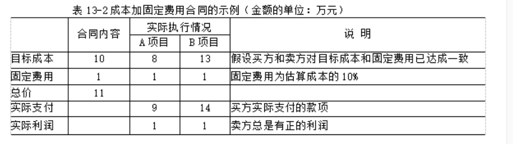
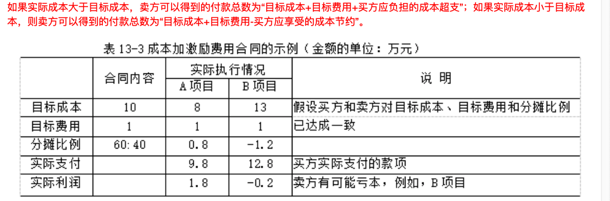

# 第13章 项目合同管理

合同的类型：

按照范围划分：

- 项目总承包合同 - 买方将项目全过程作为一个整体发包给同一个卖方的合同， 一般适用于 经验丰富、技术雄厚、组织协调能力强的卖方。  有利于发挥卖方的专业优势，保障项目进度 质量。  提高投资效益。  买方只需要与一个卖方沟通， 容易管理与协调。
- 项目单项承包合同  - 一个卖方只承包其中一项或几项内容。   卖方分别于不同卖方 签订 单项承包合同。 有利于 吸引更多的卖方参会与投标竞争。  有利于卖方专注于自身经验丰富的部分建设。   对于买方的组织管理能力提出了较高的需求。

- 项目分包合同  经合同约定和买方认可。 卖方将承包项目的某一/几部分(非主体结构)  再发包给具有资质的分包商。  

注：  签订项目分包合同 需要同时满足5个条件：

买方认可。        分包部分 非主体工作。         只能分包部分项目，不能全部。    分包方必须具备相应资质。     分包方不能再次分包。

按照类型划分：

- 总价合同(FPC)

  - 固定总价合同  - 采购价格在一开始就确定，不允许改变， 因合同履行不好导致的成本增加都由卖方承担
  - 总价加激励费用合同  允许一定的绩效偏差， 并对实现既定目标给与财务奖励。
  - 总价加经济价格调整合同 。 如果卖方履约需要数年， 且要维持多重长期关系。 可以保护买卖双方免收外界不可控情况的影响。
  - 订购单  。  当非大量采购 标准化产品时候， 通常买方直接填写卖方提供的采购单。 卖方直接供货。  不需要谈判， 又称为单边合同。

- 成本补偿合同    **向卖方支付未完成工作而发生的全部合法实际成本  外加一笔费用作为卖方的利润** ， 适用于 买方仅知道要一个什么产品  但不知道具体工作范围的情况。  工作范围很不清楚。  也适用于  买方特别信得过卖方， 想要与卖方合作。

  - 成本加 固定费用  CPFF
  - 成本加激励费用  CPIF

  - 成本加奖励费用 CPAF    成本+ 买方根据自己主观感觉给卖方一笔利润。  

    

- 工料合同  按照项目工作花费的实际工时数 和材料数量，按事先确定的单位工时及材料费用进行付款。  适用于工作性质清楚，工作范围比较明确，但是工作量无法确定的项目。     在 金额小  工时短 不复杂的项目上可以有效适用。 

合同类型的选择:

- 范围明确，  且细节也明确， 总价合同
- **工作性质清楚， 范围不是很清楚**，  **工作不复杂， 又需要快速签订合同**。   工料合同
- 工作范围尚不清楚 。  成本补偿合同。
- 双方承担风险， 工料合同。   买方承担风险， 成本补偿合同。   卖方承担风险  总价合同。

合同的内容：

- 项目名称
- 标的内容和范围
- 项目质量要求
- 项目 计划、进度、地点、 方式。
- 建设中的各种期限。
- 资料保密
- 风险责任的承担
- 技术成果的归属
- 验收标准及 方法。  
- 价款支付方式
- 违约金计算方法
- 争议解决办法
- 名词术语解释
- **相关文档资料**
- **项目变更的约定**
- **技术支持服务**

合同管理包括：

- 合同**签订**管理
- 合同**履行**管理
- 合同**变更**管理
- 合同**档案**管理
- 合同**违约索赔**管理

**合同签订管理**：

为了签约双方对合同有一致理解， 建议如下：(是建议，不是必须)

1. 使用国家或行业标准合同格式
2. 避免条款不完备或歧义引起合同纠纷， 卖方应认真审阅买方拟定的合同。 除了法律强制规定外，其他合同条款都应与买方充分协商 并达成一致的基础上约定。
3. 质量条款中写明具体的规格 型号 标准。
4. 对合同变更 转让  解除 也详细说明。
5. 如果有附件， 附件也要和合同一致
6. 可以将合同到公证机关公证。
7. 注意合同并前后内容的一致性。

在解决合同争议的方法中， 优先顺序为：  谈判     调解  仲裁  诉讼

**合同履行管理**：略

合同变更管理：略

**合同违约索赔管理：**

合同索赔的前提条件是  合同一方或双方存在违约行为和事实，并且由此造成了损失。 责任应由造成方承担。

如果是**属于客观原因造成的延期**， 属于  买方也无法预见的情况。 如： 反常天机达到合同的约定条件， **卖方可能得到延长工期，但得不到费用补偿**。

属于**买方原因造**成的拖延工期， 不仅给与卖方 **延长工期**，  还应给予 **费用补偿**  。

1. 合同索赔的起因
   - 索赔事件造成了项目额外支出或 工期损失
   - 索赔事件造成费用增加或 工期损失的原因，按合同约定 不属于索赔方应承担的行为责任或风险责任。
2. 索赔是合同管理的重要环节， 应该按照以下原则进行索赔：
   - 以合同为依据
   - 注意资料的积累
   - 及时 合理的处理索赔
   - 加强索赔的前瞻性。
3. 合同索赔流程 （6个28天）
   - 提出索赔要求，  在索赔事件发生后  28天内， 向监理工程师正式提出索赔意向通知。
   - 报送索赔资料。  在索赔通知书发出 28天内。  向监理提出延长工期 或者 补偿损失的索赔报告 及有关资料。
   - 监理答复  。    监理在收到索赔报告及有关资料后 28天内给与答复。或者要求索赔方进一步补充资料
   - 简历逾期答复后果。 (监理在收到索赔资料 28天内 未予答复或进一步要求， 则认为 索赔已经认可。)
   - 持续索赔   当索赔事件持续进行时， 索赔方应阶段性向监理发送索赔意向， 当事件终了后的28天内， 向监理送交索赔资料及最终索赔报告。 监理应该28天内给与答复 或要求索赔方进一步补充索赔理由和证据。 预期未答复 视为 索赔项成立。
   - 仲裁与诉讼    监理对索赔的答复， 索赔方或者 发包人 不能接受， 进入仲裁 或者 诉讼程序。

补充：  

合同解释的原则：

主导语言   适用法律   整体解释   公平诚信

