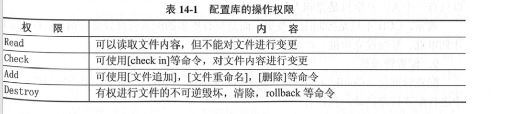
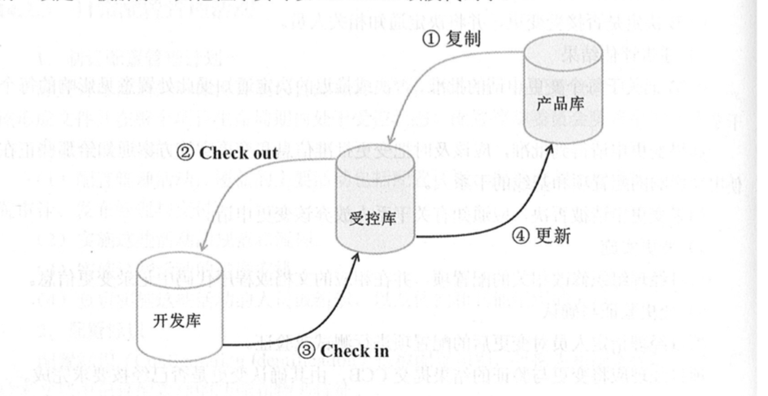

# 第14章  信息文档管理与配置管理

### 14.1.1  信息系统项目有关信息(文档)

信息系统项目相关信息(文档)种类

软件文档一般可分为三类：

- 开发文档   描述开发过程本身
- 产品文档  描述开发过程的产物
- 管理文档   记录项目管理的信息。如 开发进度记录 及进度变更记录   软件变更记录  开发团队职责定义 项目计划 阶段报告  配置管理计划。

文档的质量可以分为四个等级：

- 最低限度文档 1级文档  ，适合开发量低于1个人月的开发者自用程序。
- 内部文档 2级文档   ， 适用于没有于其他用户共享资源的专用程序。除了包含1级文档，还包含足够的注释 帮助用户安装和使用程序。
- 工作文档  3级文档 ，  适用于统一单位内若干人联合开发的程序，或可被其他单位使用的程序。
- 正式文档  4级文档  ， 正式发行供普遍使用的产品。 关键程序或具有重复管理应用性质如工资计算的程序， 需要四级文档。遵循  GB/T8567-2006中的有关规定。

### 14.1.2  信息系统项目文档管理的规则和方法

信息系统文档的规范化管理  主要体现在 ：

- 文档书写规范
- 图表编号规则
- 文档目录编写标准。
- 文档管理制度 等

### 14.2.1  配置管理的概念

配置管理是**为了系统地  控制配置变更**，在系统生命周期中 维持配置完整性 和 可跟踪性，而 **标识   系统在不同时间点上配置的学科**。

主要包括6个主要活动：

- **配置** 配置管理**计划**
- **配置标识**
- **配置控制**
- **配置状态报告**
- **配置审计**
- **发布管理与交付**

**配置项：**

为了配置管理设计的 硬件、软件 或二者的集合。在配置管理过程中作为**单一实体**来对待。

典型配置项包括： 项目计划书   需求文档  设计文档  源代码  可执行代码   测试用例  

运行软件所需的各种数据基线配置  包括所有的设计文档 及源程序

非基线配置包括 各类计划  报告。

所有配置项的操作权限由 CMO(配置管理员) 严格管理， 基本原则是  **基线配置项** 向**开发人员**开放**读取**的权限。   **非基线**配置项 向**PM CCB 及相关人员开放**。 版本管理与发布由配置管理员执行。

配置管理委员会 CCB ，负责对配置变更做出评估、 审批以及监督依批准变更的实施。CCB通常建立在项目级，  小的项目CCB可以只有一个人， 甚至只是兼职人员。

**配置项的版本号**：

配置项的状态 可分为   草稿  正式   修改 三种。 

草稿-- 评审-->  正式

正式 ----更改--> 修改

修改 ---评审-->  正式

配置项版本号：

配置项的版本号规则 与 配置项的状态无关。

草稿。  O.YZ     YZ   01----99。 随着草稿修正， YZ 递增。  YZ的取值和幅度自己把握

正式    X.Y   X为主版本号。 1-9  Y为负版本号 取值为 0-9    。当第一次为正式时候， 版本号为 1.0

修改  X.YZ   配置项修改时，增大Z，  X.Y不变。   修改完成为正式时， Z置0 增加X.Y值。  

**配置项的版本管理：**

由于我们不能保证新版本一定比旧版本好，  所以 不能抛弃旧版本。

**配置基线：**

信息系统的**开发过程是不断变化**的，  为了**不严重阻碍合理变化的情况下 控制变化**， 配置管理 引入了  配置基线 概念-- **简称 基线**。

- **基线由一组配置项构成**。 这些配置项构成 相对稳定的逻辑实体，

-  基线中的**配置项被“冻结”了**。 不能再被任何人随意修改。  

- 对基**线的变更 需要遵循正式的变更控制程序**。

产品的一个测试版本(包括 需求分析说明   详细说明   可执行代码  测试用例  测试大纲 等)  就是基线的一个例子。

基线通常对应开发中的里程碑。  一个产品 可以有1个/多个基线。(交付外部顾客-发行基线release。 内部开发用的-- 构造基线build)

对于每一个基线 需要定义如下内容：

- 建立基线的事件
- 受控的配置项
- 建立和变更基线的程序
- 批准变更基线所需的权限

建立基线有如下好处： 为开发工作提供了一个定点和快照。 当更新不稳定时，基线提供了一种取消变更的方法。 可以利用基线重建某个特定发布版本，以重现已报告的错误。

**配置库：**
配置库存放配置项 并 记录 与配置项相关的所有信息。 是配置管理的有力工具。 利用配置库 可以回答许多配置管理的问题：

-  哪些客户已提取了 某个特定的系统版本。
- 运行一个版本，  需要什么硬件 和软件
- 一个版本曾提出过那几个变更请求。  有多少已报告的错误。

配置库帮助 配置管理员  把 半成品  阶段产品  最终产品管理的井井有条。 可以分为：

- 开发库   ，也称为动态库  程序员库  工作库。 用于保存开发人员当前正在开发的配置实体。动态库是开发人员的个人工作区，由开发人员自行控制。 库中信息可能频繁更改。
- 受控库  ，也称为主库，包含当前基线+基线变更 ，  受控库中配置项在完全的配置管理下，在信息系统开发的某个阶段工作结束时，将当前的工作产品存入受控库。
- 产品库  ， 也称为静态库、 发行库 、 软件仓库，包含已发布使用的各种基线的存档。在完全的配置管理下。 在开发的产品完成测试后， 作为最终产品存入产品库内。  等待交付用户 或 现场安装。

配置库的建库模式有两种：

- 按配置型类型 分类建库。  适用于通用软件的开发组织。产品继承性强， 工具单一。
- 按开发任务建立相应的配置库，适用于专业软件的开发组织。 对于研发型组织来说，这种灵活性强。

**配置库权限设置：**

**配置控制委员会：**

配置控制委员  --  CCB 。 负责对配置变更做出 评估 审批 以及监督已批准变更的实施。

CCB建立在项目级， 成员包括 项目经理  产品经理  开发 测试  配置管理员等。  

CCB不比是常设机构， 可以根据需要组成。  **小项目CCB 可以只有一个人， 甚至兼职人员。**

CCB不止控制配置变更， 而是富有更多的配置管理任务。 如： 配置管理计划审批   基线设立审批 产品发布审批等。

**配置管理员：**

CMO configuration manage officer . **负责在 整个项目周期中 进行配置管理活动**。包括：

- 制定配置管理计划
- 建立/维护 配置管理系统/库。
- 配置项识别 
- 配置审计
- 建立/管理基线
- 发布管理与交付
- 对项目成员进行配置管理培训。

### 14.2.3 日常配置管理活动

**制定配置管理计划：**

是对如何开展项目配置管理工作的规划。是基础。其主要内容为：

1. 配置管理活动。 覆盖的主要活动包括： 配置标识  配置控制   配置状态报告  配置审计  发布管理与交付
2. 实施这些活动的规范  和 流程
3. 实施活动的进度安排
4. 负责实施的人员或 组织。

**配置标识**：

也称为配置识别， 为系统选择 配置项，  并在文档中记录配置项的功能  和物理特征。**是配置管理员的职能。**

基本步骤如下：

1. 识别 需要的配置项
2. 为配置项分配唯一标识号
3. 定义每个配置项的重要特征
4. 确定配置项所有者 及 责任
5. 确定配置项进入配置管理的时间 和条件
6. 建立 和 控制基线 
7. 维护文档 和 组件的修订 与 产品版本之间的关系。

**配置控制：**

即 配置项 和 基线的 变更控制。包括如下任务：

1.  变更申请 
2. 变更评估 （CCB负责组织变更评估，并决定是否接受变更）
3. 通知评估结果 (CCB把决定通知相关人员)
4. 变更实施
5. 变更验证与确认
6. 变更的确认
7. 基于配置库的变更控制 （测试引发了需求的修改，很可能涉及到 需求规格说明 概要设计   详细设计和代码等文档的变更）

备注说明：
如果多个开发人员对信息系统同一部件修改。如 软件发现两个BUG。 PM指定A和B 分别解决2个BUG。 结果 A放入的只有A 的修改 B放入的只有B的修改。 没有一个版本同时解决了两个故障。 

基于配置库的变更控制可以完美解决上述问题：

1. 从 产品库v2.1 取出 放入 受控库。
2. 程序员 把 代码段从受控库 检出checkout 放入自己的开发库中修改。 代码被锁定。任何其他人不能再checkout.
3. 修改完成后 checkin  到 受控库。  解除锁定。 其他程序员可以checkout这一段代码了。
4. 等全部修改工作完成后， 存入产品库中。   v2.2 .

**配置状态报告：**

配置状态报告应该包含如下内容：

- 每个受控配置项的标识和状态
- 每个变更申请的状态 和 已批准的修改的实施状态
- 每个基线的状态 以及各版本的比较
- 其他配置管理活动的记录

**配置审计：**

也称 配置审核  配置评价。包括

- 功能配置审计 -- 审计配置项的**一致性**  （配置项的实际功效是否与需求一致）  
- 物理配置审计  --  审计配置项的 **完整性 ** （配置项的物理存在是否与预期一致）

**发布管理交付：**

主要任务是  有效控制产品和文档的发行和交付，妥善保存代码和文档的母拷贝。

### 14.3.1工具概述

常见的开源免费配置管理工具有： SVN GIT CVS

