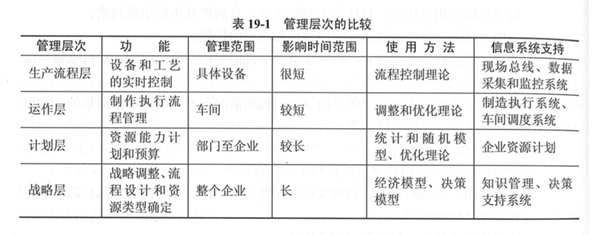
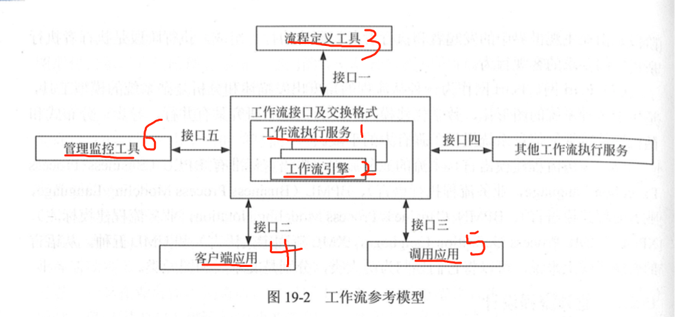

# 第19 章 流程管理

企业业务流程的整体目标是 为客户创造价值。因此以客户利益 、 员工、效益、为中心是业务流程的核心。

## 19.1  流程管理基础

良好的业务流程管理步骤包括(是一个典型的PDCA闭环过程)：

- 流程设计
- 流程执行
- 流程评估
- 流程改进。

企业的流程管理一般分为： 生产流程层  运作层  计划层  战略层。

当 运作成的调度无法解决资源配置问题时， 说明分配改流程的资源数目需要修改。 此时需要引入计划层的管理，重新进行资源能力计划的计算。  最后 底层的数据为高层的管理决策提供依据。  企业的策略管理和战略管理参数 来自对经营活动统计数据的积累。

### 19.2.1 业务流程分析

业务流程分析的具体步骤如下：

- 通过调查掌握基本情况
- 描述现有业务流程
- 确认现有业务流程
- 对业务流程进行分析
- 发现问题并提出解决方案
- 提交优化后的业务流程

业务流程分析的具体方法：

1. 价值链法  --- 找出能够让顾客满意， 实现**顾客价值最大化的业务流程**。
2. 客户关系分析法 。  就是把CRM应用在业务流程上。
3. 供应链分析法。     源自于**SCM**。
4. 基于ERP的分析法  。   ERP 基本思想是吧机器的业务流程看做一个紧密连接的供应链。
5. 业务流程重构  。   适用于**改造**原有业务流程，实现业务流程最优化。

业务流程分析的工具：

- 业务流程图
- 业务活动图示
- 基于UML的活动图
- 标杆瞄准
- IDEF
- DEMO
- petri网
- 业务流程图建模语言。

### 19.2.2 业务流程设计

业务处理流程对应于 现实中的真实业务流程。 通过对业务流程的设计 可以对其建模，以便通过信息技术取代传统手工处理，提高业务处理的效率 和准确性，降低业务处理成本。

工作流：  是一类能够全/半 自动执行的业务流程， 腾驹一些列过程规则、信息、或者任务，在不同的执行者之间传递或执行。  如  在线教育中的开通课程流程。 课程申请单--- 上级主管-- 培训部门 -- 财务。 等等。

工作流管理： 通过人与计算机共同工作自动化协调、控制、通信。 通过在网络上运行的软件，让所有活动的执行处于受控状态。 例如： 把开通课程流程自动化，并构建一个软件模块来实现该功能。

工作流参考模型workflow reference model   WRM  包含6个基本模块：

- 工作流执行服务  - 是WFMS的核心模块，功能： **创建管理 流程定义、创建管理和执行 流程实例**。 如： 新申请到来时， 可以提示上级主管。

- 工作流引擎   **为流程实例提供运行环境， 并解释执行 流程实例的  软件模块**， 即 负责流程处理的软件模块。

- 流程定义工具   **管理流程定义的工具， 以提醒方式  创建新的流程 或者 改变现有流程**

- 客户端工具    通过请求的方式 与工作流执行服务交互的作用。 

- 调用应用     **被工作流执行服务调用的应用。** 

- 管理监控工具。  **维护执行 和 管理流程 执行情况的监控**。  与工作流执行服务交互。

  

在流程设计过程中 为了清楚表达过程规则说明，出现了一些用于表达业务流程的工具。三类：

图形工具、 表格工具 和语言工具。    具体如下：

- 程序流程图  -- 图形工具 
- IPO图  -- 图形工具  **用来描述 每个模块的 输入 输出  和数据加工。需要用到 数据字典   注释   **
- 盒图 (N-S图)  - 图形工具    **用方框代替传统的PFD。** 有五种控制结构：顺序型 选择型  while循环 until循环型   多分支选择型
- 问题分析图  - 图形工具    **从最左主干线的上端的节点开始， 从上而下依次执行**
- 判定树   - 图形工具    **用数来表达不同条件下的不同处理流程**
- 判定表   -  表格工具  ，  采**用表格形式来表达逻辑判断问题。**
- 过程设计语言   - 语言工具  **仅是对算法或加工逻辑的一种描述， 是不可执行的。**

### 19.2.3 业务流程实施

**企业业务流程的设计与实施**，应建立在一个良好的企业文化及价值观之上。这样才能取得明显的绩效。具体实施过程中，**可以按以下进行**：

1. 对现有业务流程进行全面分析，发现存在问题。
2. 设计流程改进方案，并评估
3. 制定与 业务流程改造配套的 组织结构、人力资源配置、业务规范 等  形成系统的业务流程 实施方案。
4. 组织实施 与 持续改善。

### 19.2.4 业务流程评估

业务流程好坏不仅仅看 业务流程方案先进度如何   也不能仅仅看 实施过程多么热火朝天 最重要的是看实施后的效果如何， 要对业务流程评估。 

**业务流程方案评估：**

其 是 业务流程管理整个过程中 非常重要的一环。 业务流程方案评估：

1. **增值性分析**
2. 流程设计的**正确性检验**
3. 业务流程**方案的评价** 

**业务流程实施条件评估：**

企业实施业务流程管理效果的好坏 其决定因素除了方案本身优劣外 ，实施条件的好坏也是一个决定的因素。对于一个管理混乱 商法部分的企业，实施流程管理 可能会带来负面效果。 更加混乱。 

对业务流程实施条件评估 是业务流程管理中 一个重要内容。

1. **管理基础**
2. **人本管理传统**
3. **企业信息化**。

**业务流程实施效果评估：**
关键指标只要有： **产品和服务质量、 客户满意度、 销售增长率 、 成本、 员工工作效率** 等。同时取得显著效果的一个标志就是带来企业文化，特别是员工价值观的变化。

### 19.3 业务流程重构与改进

业务流程重构(business process  reengineer)  BPR  是针对企业业务流程 **根本性**反思， **彻底**再设计 使业绩取得**显著**提升。这需要企业管理人员具有创造性思维。 **其 根本性、 彻底性、 显著性、 和 流程 是BPR强调的四个核心内容。**

**BPR**在注重结果的同事，**更注重流程**的实现，并非以短期利润最大化。 而是**追求企业持续发展**的能力。 必须坚持以**流程为中心**的原则、 **团队式的管理**  原则  **以顾客为导向**     。

BPR的实施主要有两种方法， **研究企业现有业务流程重新设计  或者 从0构建企业理想的业务流程**。具体可以根据企业情况选择合适的实施方法。BPR的实施主要有以下步骤：

1. 项目的**启动**   。 启动BPR实施项目。 明确发起人地位 变革思想   描述预期。
2. **拟定计划**
3. **建立项目团队**
4. 分析需要重构的流程
5. 重新设计流程。
6. 设计评估
7. 实施新的设计
8. 持续改进

### 19.3.3 基于BPR的信息系统规划

BPR之所以能够使企业业绩 效率得到显著提高，在于充分发挥了信息技术的潜能。即 用信息技术改变业务的过程 简化业务流程。 **信息技术的应用是业务流程实施的重要保证。**   其前提就是 有一个与之配套的 信息系统规划。

基于BPR的信息系统规划的步骤如下：

- 战略规划  明确企业战略目标， 制定信息系统战略规划。
- 流程规划   
- 数据规划  
- 功能规划
- 实施规划

## 19.4 项目管理流程的管理优化

IT行业的项目管理流程一般包括五个部分：  启动  规划  执行 监控  收尾。其他章节会详细说明。 

项目管理不遵守流程是不行的， 会让项目实施陷于混乱，直接导致项目失败。 但是死守流程，不能根据实际情况变动，也是不行的。    **项目管理需要既定的流程。 但这个流程不是固定不变的， 而是 灵活的  可调整的。**   一个优秀的项目经理**要善于根据变化 优化和改进 项目管理流程，  使流程服务于项目  促进项目的成功**

### 19.4.2 敏捷项目管理

在敏捷项目管理方法中，   业界用的比较多的是 Scrum方法。--  一种迭代式增量软件开发过程。 通常用于敏捷软件开发。   敏捷项目管理的流程包括：**构想、 推测、 探索、适应、 结束。**

1. 构想 - 确定产品构想、 项目范围、项目团队 及工作方式。
2. 推测 - 指定基于功能的发布计划  里程碑计划， 确保交付构想的产品。
3. 探索  - 短期内提供经过测试的功能， 致力于 减少项目风险和不确定性。 
4. 适应 - 审核提交的结果 当前情况 ， 必要时做出调整
5. 结束  -  终止项目、交流学习成果 并庆祝。

