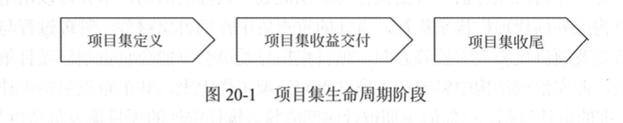

# 第20章 项目集管理

PMI把 **项目集**定义为， 经过协调管理 以获取单独管理所无法取得的收益的 **一组  相关联的项目、 子项目集和项目集活动。**

**组件** 在 项目集管理范围内用来描述项目集中的**一个或多个工作内容**

## 20.3 项目集 治理

项目集治理 通过在 授权范围内负责对项目集的建议作出签署或批准的决策活动来实现。  机构一般称为 项目集指导委员会 、项目集治理委员会、 项目集董事会。 是项目集的决策机构， 负责为项目集的管理方式提供支持。通常由决策层干系人构成，  能够为实现项目集目标收益提供足够的资源。

对于项目集治理， 主要包括以下几个方面的具体内容：

1. 项目集指导委员会的**建立**
2. 。。。的**职责界定**。
3. 项目集**治理** 和 项目集**管理之间的关系**。
4. 项目集治理相关的**个人角色**
5. 项目集作为治理主体
6. **其他支持**项目集管理的**治理活动**。

项目集指导委员会的职责主要可以概况如下：

1. 保证项目集与组织愿景和目标的一致性
2. 项目集批准和启动

项目集生命周期的划分除了根据项目生命周期方法分为  启动 计划  执行  监控  收尾这五个阶段外， 还可以**根据项目集收益的实现情况把项目集生命周期划分为  项目集定义阶段 项目集收益交付阶段   和 项目集 收尾阶段**。由于项目集的计划主要是围绕项目集的收益展开的， 因此主要采用后一种分类方式。

项目集定义阶段：

1. 构建项目集。   **项目集经理一般在项目集的构建被任命**。
2. 项目集准备。  该阶段的主要活动如下 -- 治理 -- 组织--- 计划
   - 建立**治理**结构
   - **组建**初始的**组织**
   - **制定**管理**计划**。 

项目集收益交付阶段： 略

项目集收尾阶段：

项目集收尾阶段的主要任务是 保证项目集按照预定和受控的过程进行收尾， 该过程主要包括 项目集移交和项目集关闭。

