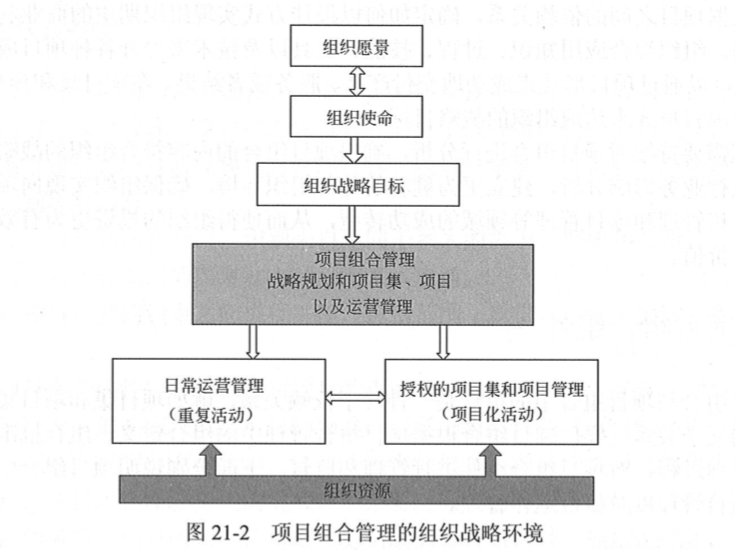
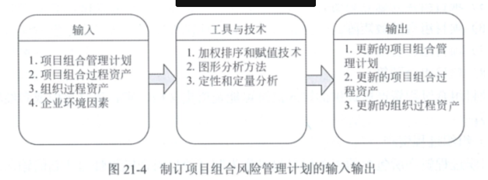

# 第21章 项目组合管理

### 21.1.1 项目组合

项目组合 是 将 项目、 项目集 以及其它方面的工作内容组合起来有效管理，以保证满足组织的战略性业务目标。

**项目组合代表了 组合的战略目标。   组合中的组件不见得要相互依赖 或 直接相关。  代表组织的 投资决策、 项目优先级的排序 以及资源的分配。 组织的意图、 方向和进展。 不是确定的 一定要完成的工作和任务**。

在组织内部 可能包括多个项目组合。    每个组合都为了实现特定的战略目标。

项目组合中所包含的模块具备如下的共同特征：

1. 能够代表组织的投资或 计划投资活动
2. 与组织的战略目标一致
3. 组织可对其进行组合管理
4. 具体可以被度量、分级、 设定优先级 等 量化管理特征。
5. 共享和竞争组织资源。

## 21.2 项目组合管理

项目组合管理    是对一组或者多组项目组合进行管理， 以达成组织的战略目标。

项目集管理   是对所包含的有关联关系项目进行管理，以满足项目集的需求， 并获取单一项目管理所达不到的收益。

项目管理  综合利用  知识、 过程、 工具和技术。 对项目活动进行管理， 以便 满足项目需求。

项目组合管理通过**项目评价**选择   **多项目组合优化**， 确保项目符合企业的战略目标，从而实现企业收益最大化。

**项目组合管理的角色和过程覆盖整个组织。**

项目组合管理、 项目集管理、 项目管理 在管理方面所存在的异同之处：

### 21.2.1 项目组合管理与组织级项目管理关系

在组织级项目管理中， **要求项目组合、项目集、 项目   与组织的战略方向保持一致** ， 另一方面， 三者为实现战略目标所做出的的贡献又有不同。

### 21.2.2 项目组合管理与组织战略

### 21.3.4  项目组合治理

项目组合治理 意味着 在组织内 建立一个治理机构。(如： 项目组合治理委员会) ， 由这个组织对项目组合的投资及优先级顺序进行决策。     组合治理机构 由一人或 多人构成。  人员具备所需的权利、知识经验。 以便判断项目组合模块是否与组织战略一致。 并作出相应的决策。

项目组合治理管理只要包括如下5个子过程：

- **制定**项目组合管理计划
- **定义**项目组合
- **优化**项目组合
- **批准**项目组合
- **执行**项目组合**监督**

### 21.4.1 项目组合管理过程 实施概述

1. **评估** 项目组合管理   过程的当前状态。
2. **定义** 项目组合管理  的愿景和计划
3. **实施** 项目组合管理  过程
   - 为项目组合管理过程的实施  **定义角色和职责**
   - **沟通** 项目组合管理**实施计划**
   - **定义和部署详细的** 项目组合管理**过程** ，**并**为参与人员和干系人**提供培训**。

4. **改进** 项目组合管理  过程。

### 21.6.1  项目组合管理过程组

略

## 21.7 项目组合风险管理

项目组合风险管理 不同于项目风管理以及项目集风险管理。在项目组合级别， 组织可能会选择风险较高的方案， 从而获得更高的汇报。   项目集风险管理  项目风险管理关注的风险更多来自于项目集 或项目的内部。

项目组合则重点关注一下三个方面的目标：

- 项目组合财务价值最大化。
- 裁剪项目组合，确保符合战略目标。
- 在给定的限制条件下，对组合中的 项目集 和项目 进行平衡。

项目组合风险管理过程主要包括： **制定项目组合风险管理计划。 和 管理项目组合风险** 两个过程。

制定项目组合风险管理计划：

管理项目组合风险： 

分为了四个阶段： 风险识别  风险分析  风险相应  风险监控

