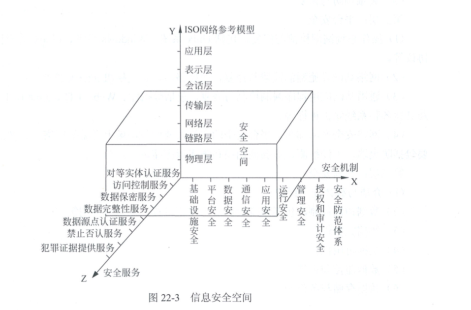

# 第22章  信息系统安全管理

### 22.1.1  信息系统安全策略的概念与内容

安全策略的核心内容就是 7定。 既  定**方案** 定**岗** 定**位**  定**员**  定**目标**   定**制度**  定工作**流程**。

**方案、 岗、位、员、 目标  制度  流程。**

按照7定， 首先要解决定方案， 其次  就是 定岗。

### 22.1.2 建立安全策略需要处理好的关系

根据 计算机信息系统安全保护等级划分准则( GB17859-1999 ) 是建立安全等级保护制度， 实施安全等级管理的重要基础性标准。   它把计算机信息系统分为以下5个安全保护等级。

- **第一级  用户自主保护级。     适用于普通内联网用户。**
- **第二级   系统审计保护级        适用于 通过内联网或国际网进行商户活动， 需要保密的非重要单位。**
- **第三级  安全标记保护级       适用于，地方各级国家机关、单位机构、邮电通信 交通运输、大型信息技术企业、重点工程建设 等单位**
- **第四级  结构化保护级    适用于 中央级国际安机关、重要物质储备部分、社会应急服务部分、尖端科技集团、重点科研机构、 国防建设 等部门。**
- **访问验证保护级    适用于 国防关键部门 和依法需要对计算机信息系统实施特殊隔离的单位。**

信息系统安全保护等级由两个定级要素决定： 等级保护对象收到破坏时**所侵害的客体** 和 对客体**造成侵害的程度**。

会对公民、法人和其他组织的合法权益造成**损害**， 但 **不损害**国家安全、社会秩序、公共利益。  则为第一级

会对公民法人和其他组织的合法权益造成严重损害，或者对社会秩序和公共利益造成**损害**， 但不损害国家安全，则为第二级

会对社会秩序 、**公共利益造成 严重损害**， 或者对国家安全造成损害，则为第三级

对社会秩序 公共利益造成特别严重损害， 或者 对国家安全造成严重损害， 则为 第四级。

信息系统遭到损害后，会对国家安全造成特别严重损害。  则为第五级。

总结：

- 不损害 公共利益    1 级  自主
- 损害公共利益    2级     审计
- 严重损害公共利益 3级   标记
- 特别严重损害公共利益 4级   结构化
- 国家安全严重损害     5级   验证

### 22.2.2 信息安全系统

信息安全保障系统 简称为  信息安全系统。  它是 信息系统的一个部分。   信息安全系统是客观的、独立于业务应用信息系统而存在的信息系统。  可以用一个宏观的三维图 来反应 信息安全系统的体系架构 及其组成：

X轴 是 **安全机制**。

Y轴 是 **OSI**网络参考模型

Z轴 是 **安全服务**。

x y  z三个轴形成的信息安全系统三维空间 就是  信息系统的安全空间。  随着网络逐层扩展， 空间范围逐渐加大， 安全的内涵也更丰富。   达**到具有 认证、 权限、 完整、 加密、   不可否认 五大要素。 也叫做。 安全空间的5大属性。**

安全服务：

- 对等实体认证服务
- 数据保密服务
- 数据完整性服务
- 数据源点认证服务
- 禁止否认服务
- 犯罪数据提供服务

### 22.3.1 公钥基础设施(PIK)基本概念

公钥基础设施 PKI  public key infrastructure  是以 不对称加密技术为基础， 以数据机密性、完整性、 身份认证、 和行为不可抵赖性为安全目的， 来试试 和提供安全服务的具有普适性的安全基础设施。

一个网络的PKI包括以下几个基本的构件：

数字证书      

认证中心

数字签名

访问控制有两个重要过程：

- 认证过程  ， 检查合法身份
- 授权过程   ，   赋予用户对某项资源的访问权限

### 22.4.5  PMI (权限管理基础设施)支撑体系 

目前我们使用的访问控制授权方案， 主要有以下四种：

- **DAC**  自主访问控制方式   ，  对每个用户明确能否访问的资源，不在列表中的对象不允许访问。
- **ACL**  访问控制列表方式 ， 目前应用最多。目标资源拥有访问权限列表，指明允许哪种用户访问。如果用户不在访问控制列表中， 则不允许用户访问这个资源。
- **MAC**  强制访问控制方式  。在军事和安全部门中应用较多，目标具有一个安全等级标签。访问者具有包含等级的列表。 如：允许访问秘密级别信息。
- **RBAC** 基于角色的访问控制方式   首先定义一些角色，如 局长  科长 等。 然后给角色分配权限。 然后给每个人分配一个 或多个角色。

  

### 22.5.1 安全设计的概念

安全审计 是记录、 审查 主体 对客体进行访问和使用情况保证安全规则被正确执行， 并帮助分析安全事故的原因。

安全审计具体包括两方面的内容：

1. 网络监控 + 入侵防范， 识别攻击 并进行阻断。
2. 对业务流程进行审计， 防止内部机密信息的非法泄漏 和单位资产的流失。

一个安全审计系统 ， 主要有以下作用：

- 震慑潜在攻击
- 对已发生的破坏行为 进行追究证据
- 为安全管理员提供有价值的系统日志，帮助发现入侵行为 或者漏洞
- 为安全管理员提供统计日志， 帮助发现系统性能不足 或需要改进的地方。

网络安全审计具体内容如下：

- 监控网络内部的

