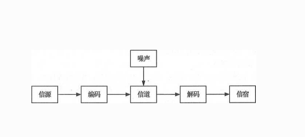
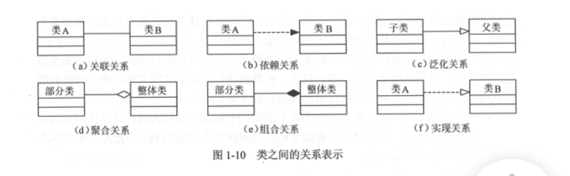

# 第一章 信息化知识

信息是客观事物状态和运动特征的一种普遍形式。   信息就是信息，不是物质也不是能量。 信息就是能够用来消除不确定性的东西，信息是事物普遍联系的方式。

事物的本体论信息， 就是**事物的运动状态** 和 **状态变化**方式的自我描述。

信息的传输技术(通常指通信、网络等) 是信息技术的核心。

当信源 和信宿已给定，  信道也选定后， 决定信息系统性能就在于编码器 和译码器。  设计一个信息系统时，除了选择信道和设计其附属外，主要工作就是设计编、译码器。  一般情况下， 信息系统的主要性能指标是有效性和可靠性。   **有效性**就是在系统中传送尽可能多的信息。   而**可靠性** 是要求信宿收到的信息尽可能地于信源发出的信息一致， 或者说失真尽可能小。

信息满足一定的质量属性。

- 精确性  ，对事物描述的精准程度
- 完整性 ， 对事物描述的全面程度， 完整信息应包括所有重要事实。
- 可靠性 ，  对信息的来源、 采集方法， 传输过程是可以信任的 符合预期
- 及时性  ， 获得信息的时刻 和 事件发生时刻的间隔长短。 昨天的天气无论如何精确  完整   对指导明天的穿衣并无帮助。从这个角度看，这个信息的价值为0
- 经济型   信息获取 、传输 带来的成本 在可以接受的范围之内。
- 可验证性  信息的主要质量属性 可以被证实或者 证伪的程度。
- 安全性   指在信息的生命周期中， 信息可以被非授权访问的可能性， 可能性越低， 安全性越高。

信息系统典型示例：

- 信源。 产生信息的实体。  信息产生后，由此向外传播。如QQ使用者。
- 信宿 。 信息的归宿或者接受者。  如： QQ的另一方
- 信道 。 传输信息的通道。如：GCP/IP网络、 光纤 双绞线 等。
- 编码器。  是指所有变换信号的设备， 实际上就是终端机的发送部分。 包括所有信源到信道的所有设备 如：量化器、压缩编码器、调制器等
- 解码器(译码器)， 是编码器的逆变换设备。 把从信道送来的信号(原始信息和噪声的叠加) 转换为信宿能接收的信号，可保罗： 解调器、 译码器、  数模转换器等。
- 噪声 。  就是干扰。  当噪声大到一定程度， 信道中的信息可以被噪声淹没导致传输失败。

系统具有如下特点：

- 目的性， 目标性决定了系统的性能。
- 可嵌套性
- 稳定性
- 开放性
- 脆弱性
- 健壮性

我国当前信息化建设处于深入发展阶段。推动信息化建设对拉动内需 推动经济结构调整  改善民生具有重要意义。

信息化从小到大分为5个层次：

- 产品信息化
- 企业信息化
- 产业信息化
- 国民经济信息化
- 社会生活信息化

信息化的主体是 **全体社会成员** ，  包括 政府 企业 事业单位  团体 和个人。它的时域是一个长期的过程， 他的空余 是 政治 经济 文化  均势和社会的一切领域。 它的手段是基于现代信息技术的先进社会生产工具。 他的途径是  创建信息时代的社会生产力，推动 社会关系及 上层建筑的改革， 目标是使国家的综合实力、社会的文明素质 和人民的生活质量全面提升。

我国陆续建成了一站   两网  四库 十二金 工程为代表的国家级信息系统。

-  一站   政府门户网站  G2C 
- 两网。 政务内网 和政务外网
- 四库， 人口  法人单位 空间地理和自然资源   宏观经济 等四个基础数据库
- 十二金   是指以 金 字冠名的12个重点业务系统。

国家信息化体系包括6个要素：

- 信息技术应用  ， 是6要素中的**龙头**， 是 信息化建设的主阵地。
- 信息资源    信息资源的开发利用是 国家信息化 的核心人物，  是国家信息化建设取得实效的**关键**。
- 信息网络    是现代化国家的**重要基础设施**。
- 信息技术和产业     是信息化建设的**基础**
- 信息化**人**才    是 信息化建设 **成功之本**，  是 信息化建设的关键
- 信息化政策法规和标准规范   是国家信息化快速 健康发展的 **根本保障**

软件的生命周期：

- 可行性分析与项目开发计划
- 需求分析
- 概要设计
- 详细设计
- 编码
- 测试
- 维护 等

信息系统生命周期可简化为如下5个阶段：

- 系统规划（可行性分析和项目开发计划）产出 可行性报告   系统设计任务书
- 系统分析（需求分析）  提出新系统逻辑模型。
- 系统设计(概要设计  详细设计)  提出新系统屋里模型，又称为物理设计阶段， 分为 总体设计(概要设计) 和详细设计两个子阶段，阶段的技术文档是 系统设计说明书。
- 系统实施(编码  测试) 每个阶段应写出实施进展报告， 系统测试后，写出  系统测试分析报告
- 运行维护

**还可以简化为：**

- **立项（系统规划）**
- **开发** (系统分析  系统设计  系统实施)
- **运维**
- **消亡**

项目的生命周期又划分为    **启动  计划   执行  和收尾** 四个典型的阶段。

国家十三五规划中， 把如下四项作为新一代信息技术产品创新重点发展。

- 人工智能
- 移动智能终端
- 5G
- 先进传感器

信息化的基本原则：

- 统筹发展 有序推进
- 需求牵引  市场导向
- 完善机制 创新驱动
- 加强管理 保障安全

电子政务主要包括如下四个方面：

- 政府间电子政务 G2G
- 政府对企业电子政务 G2B
- 政府对公众电子政务  G2C
- 政府对公务员电子政务 G2E

完善电子政务明天， 完成以 **云计算**  为基础的电子政务公共平台顶层设计。

提高政务信息系统的信息安全保障能力：

- 建设完善信息安全保障体系- 建设 完善的体 系
- 制定电子政务安全可靠的标准规范 - 制定可靠的规范
- 进一步加强支付信息系统安全管理 - 加强安全管理。

信息系统开发方法包括 结构化方法、 面向对象方法、 原型化方法、面向服务的方法等。

结构化方法 也称为 生命周期法，包括：

- 结构化分析SA - structure analysis
- 结构化设计SD  - structure design
- 结构化程序设计 SP  -structrue programing 

其精髓是自订向下  逐步求精  模块化设计。其是目前最成熟 、应用较广泛的一种工程化方法， **特别适合于数据处理领域**的问题 。 不适应于 较大规模 比较复杂的开发。  具有如下局限性：

- 开发周期长
- 难以适应需求变化
- 很少考虑数据结构

面向对象方法：

其认为世界由各种对象组成，任何对事物都是对象， 每个对象都有自己的运动规律和状态， 都属于某个类， 是该对象类的一个元素。

其符合人们的思维习惯，有利于开发人员交流，缩短开发周期， 普遍使用与各类信息系统开发。 但是 也有不足：

- 必须依靠一定的OO技术支持，
- 在大型项目上有局限性， 不能涉足系统分析前的开发环节。

当前一些大型信息系统的开发，通常是 结构化方法(自顶向下整体划分) + 面向对象(自底向上开发)结合。   因此二者是两种在信息开发领域中相互依存的 不可替代的方法。

原型化方法：

也称为快速原型法，简称原型法。以是否实现功能来分：

- 水平原型  用在界面上
- 垂直原型  用在复杂算法上

以原型的最终结果来分：

- 抛弃式原型 ，主要用在解决需求不确定性、二义性、 含糊性  不完整性
-  演化式原型    主要用于必须易于升级和优化的场合，特别适合Web项目

面向服务的方法

提高系统**可复用性**、信息**资源共**享、 系统之间的**互操作性**

TCP/IP协议(四层)

- 应用层协议： FTP TFTP  HTTP SMTP DHCP  Telnet  DNS   SNMP（简单网络管理写）

- 传输层协议：  TCP  UDP

- 网络层协议： IP  ICMP IGMP ARP  RARP

- 网络接口层

OSI协议(7层)

- 应用层   FTP TFTP  HTTP SMTP DHCP  Telnet  DNS   SNMP

- 表示层   JPEG ASCII GIF  DES  MPEG   

- 会话层 RPC  SQL NFS

- 传输层  TCP UDP

- 网络层  IP  ICMP IGMP ARP   IPX

- 数据链路层  802.3  HDLC   PPP  ATM

- 物理层：  RJ-45 RS232  FDDI

以太网规范802.3   是重要的局域网协议

## 1.3 

网络存储技术

- 直接附加存储 (DAS  direct attach storage) - 通过SCSI 电缆直接连到电脑上
- 网络附加存储 NAS 
  - NFS 网络文件系统
  - CIFS 通用Internet文件系统
- 存储区域网络 SAN
  - FC SAN  光纤通道
  - IP SAN   基于IP网络实现
  - IB SAN   无线带宽是一种交换结构I/O技术

网络接入技术：

- 有线接入
  - PSTN   - 公用交换电话网络
  - ISDN   -  综合业务数字网 - 俗称一线通
  - ADSL    - 非对称数字用户线路
  - FTTX+lan
    - FTTC  - 光纤到路边(curb)
    - FTTZ  - 光纤到小区
    - FTTB   - 光纤到楼（building）
    - FTTF  - 光纤到楼层
    - FTTH -  光纤到户
  - HFC接入
- 无线接入
  - wifi 
  - 4G
  - 5G

网络规划与设计：

- 机密性 -  不暴露给未授权的实体
- 完整性 -  得到允许才能修改， 且能判断出数据是否被篡改。
- 可用性 ，攻击者不能占用所有资源而阻碍授权
- 可控性 。 控制授权内的信息流向和行为方式
- 可审查性 。 对安全问题提供调查依据和手段

为了达成上述目标，需要做的工作有： 指定安全策略  用户验证  加密   访问控制 审计与管理

高可用性 和高可靠性的规划与设计：

- 可用性  是系统能够正常运行的时间比例， 常见的可用性战术如下：
  - 错误检测  命令/响应  心跳
  - 错误恢复  表决  冗余
  - 错误预防  把可能出错的组件从服务中删除， 引入进程监视器

- 可靠性  是软件系统再应用或系统错误面前，维持软件系统功能特性的能力。

需求分析：

- 需求的层次
  - 业务需求
  - 用户需求
  - 系统需求
- 质量功能部署。 质量功能呢部署 QFD 是一种将用户要求转化为软件需求的技术，目的是最大程度提升软件工程过程中的用户满意度。
- 需求获取 - 用户访谈   问卷调查  采样  情节串联版  联合需求计划
- 需求分析 。 使用SA方法进行需求分析，有三个层次的模型：
  - 数据模型 - E-R图表示数据模型
  - 功能模型 - 数据流图DFD 表示 功能模型
  - 行为模型(状态模型) 状态转换图  STD 表示行为模型。

- 软件需求规格说明  GB/T 8567-2006中， 提供了SRS文档模板 和编写指南。
- 需求验证（需求确认）

## 1.4. 

UML：

UML  是一种通用的 可视化的建模语言，并不是一种编程语言。 其是面向对象 分析和设计的一种标准化表示， 用于对软件进行描述、可视化处理 、构造和监理软件系统的文档。

UML 用关系把事物结合在一起，主要有下面四种关系：

- 依赖  两个事物之间的语义关系
- 关联  描述一组对象连接结构关系
- 泛化  一般化和特殊化的关系 
- 实现  是类之间的语义关系

UML2.0 包括14种图，列举如下：

- 类图   描述一组类、接口  、协作和他们直接的关系。

- 对象图   描述一组对象及它们之间的关系

- 构件图   描述  一个封装的类和它内部的接口端口， 以及由内嵌的构建 和连接件 构成的内部结构

- 组合结构图   描述结构化类(构件或者 类)的内部结构 及其与系统其余部分的交互点。

- 用例图   描述一组用例、参与者 之间的关系。

- 顺序图    是一种交互图， 强调消息的时间顺序的交互图。

- 通信图    是一种交互图，强调收发消息对象或参与者的结构组织。

- 定时图    是一种交互图， 强调消息跨越不同对象或参与者的实际时间。

- 状态图    描述一个状态机， 由状态、转移、事件、活动组成。

- 活动图    将进程或其他计算结构展示为计算内部一步步的控制流和数据流。

- 部署图  描述对运行时的处理节点及在其中生存的构件的配置。

- 制品图  描述计算机中一个系统的物理结构。

- 包图     描述由模型本身分解而成的组织单元，以及他们之间的依赖关系。 

- 交互概览图   是活动图和顺序图的混合物。

  

UML视图：

- 逻辑视图  也称为设计视图，标识了 设计模型中 架构方面重要意义的部分。即：类  子系统 包 和用例实现的自己。

- 进程视图  是可执行线程和进程作为活动类的建模， 是逻辑视图的一次执行实例，描述了并发和同步结构

- 实现视图  对组成系统的物理代码的文件和构件进行建模。

- 部署视图  把构件部署到一组物理节点上，标识 软件到硬件的映射和分布结构。

- 用例视图   是最基本的需求分析模型。

面向对象分析：

面向对象分析阶段核心工作是：  **建立系统的用例模型和分析模型**

- 用例之间的关系主要有 包含    扩展    泛化    
- 分析模型

建立分析模型的过程大致包括：  

- 定义概念类
- 确定类之间的关系 
- 为类添加职责
- 建立交互图

前三个步骤称为： CRC （class  responsibility  collaboator  类 责任   协作者）建模。

类之间的关系主要有：

- 关联
- 依赖
- 泛化
- 聚合
- 组合
- 实现

软件架构设计：

软件架构风格

1. 数据流风格   包括批处理序列和 管道/过滤器风格
2. 调用返回风格   包括主程序/子程序 数据抽象和面向对象  以及层次结构
3. 独立构件风格   包括进程通信 和事件驱动的系统
4. 虚拟机风格     包括解释器 和基于规则的系统
5. 仓库风格      包括数据库系统   黑板系统   和  超文本系统。

软件架构评估

**在架构评估过程中， 评估人员所关注的是系统的质量属性**

敏感点是一个或多个构件的特性， 权衡点是影响多个质量属性的特性。是多个质量属性的敏感点。

软件架构评估技术：

- 基于问卷调查(或检查表)的方式
- 基于场景的方式 --（最常用）如：
  - 架构权衡分析法
  - 软件架构分析法
  - 成本效益分析法

- 基于度量的方式

ooa 面向对象分析  ood面向对象设计  oop面向对象编程

**面向对象分析的结果可以作为开始面向对象设计的模型，面向对象的设计结果可以作为蓝图，利用面向对象编程方法最终实现一个系统**

软件设计：

- 结构化设计 -SD 是一种面向数据流的方法， 基本原则：**高内聚 低耦合**
- 面向对象设计 。 OOD是OOA方法的延续，基本思想： 抽象 封装  可扩展性。。 如何同时提高软件的可维护性和和可复用性是OOD需要解决的核心问题之一
- 设计模式  包括模式名称、 问题、 目的 、 解决方案 、 效果、 实例代码 相关设计模式 等。设计模式是前人的总结经验，方便人们复用成功的软件设计。  类模式处理类 和子类的关系 ，通过继承建立， 编译时被确定下来属于静态关系。    对象模式处理对象之间的关系， 且在运行时动态变化， 更具备动态性。

**软件测试及其管理**

测试的方法：

- 静态测试 
  - 文档静态测试，主要包括：
    - 检查单
  - 代码静态测试，主要包括
    - **桌前**检查
    - 代码 **走查**
    - 代码**审查**
- 动态测试 ，指在计算机上实际运行程序进行软件测试。
  - 白盒测试， 主要用在单元测试中。 如人工检查代码等。 主要有三种：
    - 控制流测试
    - 数据流测试
    - 程序变异测试
  - 黑盒测试 ， 也称为功能测试 。 主要有三种
    - 集成测试
    - 确认测试 
    - 系统测试

测试的类型：

- 单元测试 也称为模块测试 ，检测每个模块是否实现了**设计说明中的约束条件**。
- 集成测试   ，检查模块间的接口关系 验证软件是否符合设计要求。依据 **软件设计概要文档**  ，之前要确认模块已通过单元测试
- 确认测试     **确认**软件功能特性是否**与用户需求一致**
- 系统测试     **验证配置项**是否能和**系统正确连接**。
- 配置项测试     **验证配置项是否和SRS一致**
- 回归测试     **测试变更的正确性**

面向对象的试试：

OO系统具有三个明显的特点：  **封装线 、 继承性、 多态性**。 由于这些特性， 给OO系统的测试带来了一些困难。

软件测试的管理包括：  过程管理  配置管理   评审工作

结束测试工作后，  要把全部测试工具、被测软件、测试评审结果 纳入配置管理。

软件集成技术：

软件层次的集成技术 企业应用集成(EAI)包括如下多个层次 和方面：

- 表示集成 又叫界面集成，  是黑盒集成， 无需了解程序 与 数据库的内部构造。
- 数据集成   解决数据 和数据库 的集成问题。   是白盒集成
- 控制集成  功能集成或应用集成，是在业务逻辑成集成，  是黑河测试。
- 业务流程集成    也称为过程集成，    超越了 数据和系统。 
- 企业之间的应用集成     适用于大多数电子商务企业， 以及 企业之间的应用集成。

物联网：

- 物品和物品的互连 T2T
- 人和物品的互连 H2T
- 人和人的互连 H2H

牵涉两项核心技术  传感器技术 和 嵌入式技术。

- 传感器技术， 把模拟信号转化为数字信号，RFID 射频识别 是物联网中使用的一种传感器技术。
- 嵌入式技术   综合了计算机软硬件 传感器 集成电路   电子应用技术为一体得分复杂技术。

物联网架构分为三层：

- 感知层  -- 各种传感器   RFID  读写器 二维码 GPS
- 网络层    互联网  网络管理系统 云计算平台 等
- 应用层   物联网和用户的接口，与实际需求结合实现 物联网的智能应用。

物联网在城市管理中综合应用就是智慧城市。

1. 全方位采集城市系统数据
2. **通过网络将城市数据**关联融合 **处理** 分析**为** **信息**
3. 充分**共享**  智能**挖掘**  **形成 知识**
4. 结合**信息技术**，应用到各行各业 **成为智慧**

云计算：

按照自愿层次分为：

- IAAS   基础设施即服务
- PAAS  平台即服务
- SAAS  软件即服务

## 1.5

大数据：

业界通常用5个V 来概括大数据的特性。 （volume大量    variety 多样   value 价值  velocity vericity高速  真实性）

大数据具有体量大  结构多样  时效性强 的数据， 处理大数据需要新型计算架构 及 智能算法。大数据查询分析复杂。

大数据从数据源到获得最终价值一般需要5个环节：

- 数据准备
- 数据存储与管理
- 计算处理
- 数据分析
- 知识展现

移动互联：

互动互联网的核心是 互联网   ，移动互联网是桌面互联网的补充和延伸，应用和内容仍是移动互联网的根本。

移动互联网有如下特点：

- 终端移动性
- 业务使用的私密性
- 终端和网络的局限性
- 业务 、终端 、网络的强关联性

## 1.6 信息安全

信息安全强调信息(数据)本身的安全属性。 主要包括如下：

- 私密性   信息不被未授权者知晓的
- 完整性   信息正确真实  未被篡改 完整无缺
- 可用性    信息可以随时正常使用

针对信息系统，安全可以划分为以下四个层次：

- 设备安全
  - 稳定性   设备一定时间内不出故障的概率
  - 可靠性    设备能在一定时间内正常执行任务的概率
  - 可用性    设备随时可以正常使用的概率
- 数据安全 (私密性 完整性  可用性， 上面已讲过，数据泄露  数据篡改 都是数据安全问题)

- 内容安全 (政治上健康 符合法律 符合道德)
- 行为安全 

信息安全等级保护：

《信息安全等级保护管理办法》 将信息系统的安全保护等级分为以下五级：
第一级：受到损坏后 ，会对公民 法人 和其他组织的合法权益收到损害

第二级：受到破坏后，会对公民 法人 其他组织 严重损害， 或者 对 社会秩序 公共利益造成损害。

第三级：受到损坏后， 会对社会秩序和公共利息造成严重损害， 或者对国家安全造成损害

第四级：受到损坏后， 会对社会秩序和公共秩序造成特别严重损害，或者对国家安全造成严重损害
第五级： 受到损坏后， 会对国家安全造成特别严重损害。

GB17859-1999中 对计算机系统安全防护能力的5个等级：

- **用户自主**保护级
- **系统审计**保护级
- **安全标记**保护级
- **结构化**保护级
- **访问验证**保护级

加解密与常用算法：

信息认证：

数字签名的概念：
完善的数字签名体系应满足以下三个条件：

- 签名者时候**不能抵赖**自己的签名
- 任何其他人**不能伪造**签名
- 如果当事双方对真伪有争执，**可以在公正的仲裁**面前通过验证签名来确认真伪。

利用**RSA**密码可以同时实现**数字签名 和 数据加密**。

信息系统安全：

如：网络安全， 常见的网络威胁包括：

- 网络监听
- 口令攻击
- 拒绝服务攻击DOS
- 漏洞攻击。 如利用WEB漏洞 和 openssl安全漏洞实施攻击
- 僵尸网络
- 网络钓鱼
- 网络欺骗。 arp欺骗 dns欺骗  ip欺骗  web欺骗  email欺骗
- 网站安全威胁 。 sql注入攻击  跨站攻击  旁注攻击等。

为了防御上述威胁， 及时发现攻击线索 修补漏洞  记录 审计网络访问日志， 以及尽可能保护网络环境安全， 可采取如下安全防御技术：

- 防火墙    阻挡对网络的非法访问 和不安全数据的传递。 防火墙的安全策略由安全规则标识。主要依靠安全策略进网络管理， 策略内的可以有效管理， 策略外的访问行为无法控制。
- 入侵检测与防护
  - 入侵检测系统 IDS    注重的是对网络安全状况的监管。绝大多数是被动的。
  - 入侵防护系统 IPS     注重提供主动防护， 注重对入侵行为的控制。
- VPN   虚拟专用网络，其是依靠ISP和nsp(网络服务提供商) 在公网简历专用 、安全的数据通道技术。vpn是 加密和认证技术在网络传输中的应用。
- 安全扫描  漏洞扫描  端口扫描 密码扫描(发现弱口令密码)等
- 网络蜜罐  是一种主动防御技术，是一个包含漏洞的诱骗系统，通过模拟一个或多个易受攻击的主机和服务， 给攻击者提供一个容易攻击的目标。

操作系统安全：

针对操作系统的安全威胁按照行为方式划分， 通常有下面四种：

- 切断   ， 对可用性的威胁
- 截取  ， 对机密性的威胁 
- 篡改，   对完整性的威胁
- 伪造 ，  对合法性的威胁

