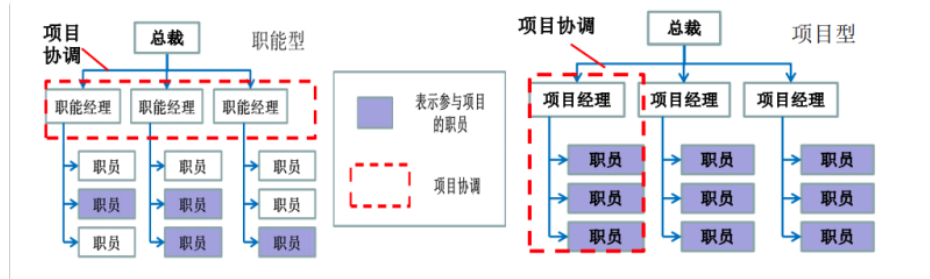
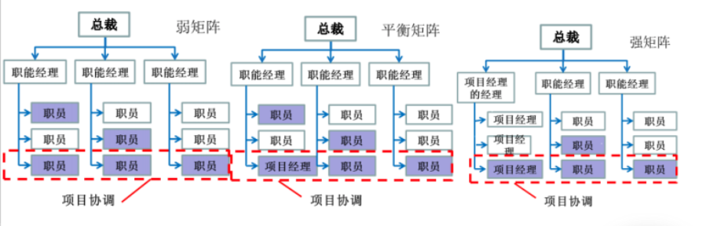
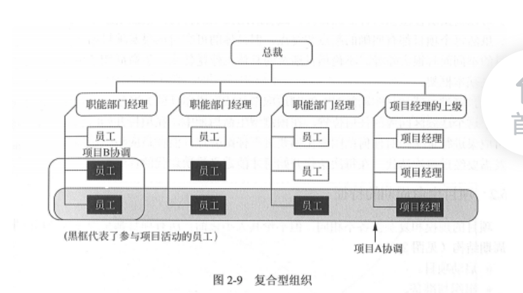
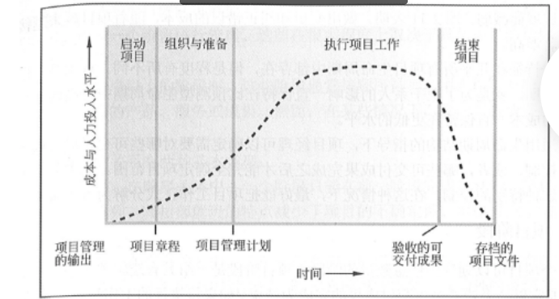
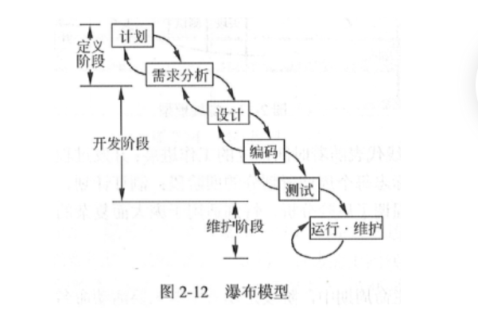
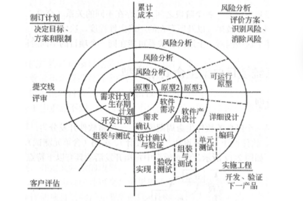
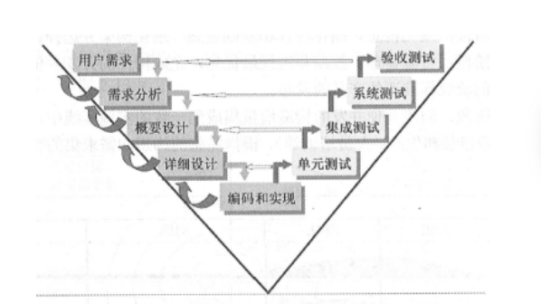

# 第2章  信息系统项目管理基础

### 2.1.1 项目的概念

项目是为了提供一项 独特的产品/服务 所做的临时性努力。

项目的特点：

- 临时性
- 独特性
- 逐步完善(渐进明细)
- 资源约束
- 目的性

每个项目都会在 时间 成本 质量等方面收到约束，这些约束称为项目成功的三约束。 另一个主要的约束就是项目的范围。

### 2.1.3 项目和日常运作(运营)的关系

日常运作 也可称为运营

二者主要区分点在于：

- 运营 具备 持续性 重复性。     项目是 临时 独特的。
- 二者目标不同， 项目是为了实现目标 然后结束项目， 而运营 目标一般是为了持续经营。
- 项目的实现机制和 运营 大相径庭，当宣布目标实现时， 项目就结束了， 相比之下，运营是确定一组新目标 继续持续进行。

### 2.1.5 信息系统项目的特点

其是在系统工程的指导下 ，根据 需求分析 + 软硬件技术规范 ，对 软件 硬件 业务  人员 有机结合 形成的完整体系。

信息系统是由计算机硬件、网络和通讯设备、 计算机软件、信息资源、信息用户、 规章制度组成的以处理信息流为目的的人机一体化系统。

### 2.1.6 项目管理定义

项目管理就是把各种知识 、技能、手段 应用到项目活动之中，以达到项目的要求。

- 项目管理是 一种 **管理方法体系**。
- 项目管理的**对象是 项目**，  **目的是实现项目的预定目标**
- 项目管理的**职能**是对**组织的资源**进行计划、组织、指挥、 协调、控制。项目管理的任务是项目及其资源的计划、组织、指挥、协调、控制。
- 实现项目目标的责任和权利 往往被集中到一个人(项目经理)或一个小组身上。
- 项目管理的职能主要是由项目经理执行的。

## 2.2 项目管理知识体系

有效的项目管理要求项目经理至少能理解和使用以下五方面的专业知识领域：

- **项目管理知识**体系
- **应用领域的知识**、标准和规定
- **项目环境知识**
- **通用管理知识**和技能 
- **软技能**或人际关系技能

对于项目成员来说， 没有必要要求所有人在这五方面都是专家，

一般的管理知识和技能包括 计划、组织、人事、执行和控制一个正在运行的企业的运作。

软技能包括人际关系管理， 软技能包含以下内容：

- 有效的沟通 
- 影响一个组织 (让事情办成的能力)
- 领导能力 （形成一个战略 并组织人员达到他）
- 激励 
- 谈判和冲突管理
- 问题解决

**组织的类型：**

   

复合型组织：

根据工作需要， 一个组织内运作项目时，或多或少 **同时包含上述三种组织形式**。这就构成了复合型组织。

例如： 一个完全职能型的组织也可能会组建一个专门的项目团队来操作重要项目。

**项目生命周期的特征：**

所有项目都呈现下列通用的生命周期结构：

- 启动项目
- 组织与准备
- 执行项目工作
- 结束项目

通用生命周期结构具备如下的特征：

- 成本与人力投入水平，开始时最低， 执行工作时最高， 快要结束时快速回落。

- 风险与不确定性， 开始时最大 随着决策的制定与可交付成果的验收而逐步降低

  

**单个项目的管理过程：**

过程就是一组为了完成某个可交付成果而需执行的相互联系的行动或活动。软件开发项目 面向产品的过程一般有：

- 需求获取 
- 需求分析
- 概要设计
- 详细设计
- 编码
- 单元测试
- 集成测试
- 验收测试和安装部署等 

项目管理的各过程组可以对应到戴明环(PDCA). plan  do check action . 

​          plan --  do  -- check -- action 

启动   规划    执行        监控                       收尾

**项目管理过程组：**

**5大过程组 && 10大知识领域 十五矩阵**：(**△**)

| 知识领域 \  过程组     | 启动             | 规划                                                         | 执行                                           | 监控                                     | 收尾               |
| :--------------------- | ---------------- | ------------------------------------------------------------ | ---------------------------------------------- | ---------------------------------------- | ------------------ |
| 项目整合管理           | 4.1 制定项目章程 | 4.2 制定项目管理计划                                         | 4.3 指导与管理项目工作 4.4  管理项目知识    | 4.5 监控项目工作 4.6 实施项目变更控制 | 4.7 项目结束或阶段 |
| 项目范围管理           |                  | 5.1 规划范围管理 5.2 收集需求 5.3 定义范围 5.4 创建WBS |                                                | 5.4 确认范围 5.5 控制范围             |                    |
| 项目进度管理           |                  | 6.1  规划进度管理 6.2 定义活动 6.3 排列活动顺序 6.4 估算活动持续时间 6.5 制定进度计划 |                                                | 6.6 控制进度                             |                    |
| 项目成本管理           |                  | 7.1 规划成本管理 7.2 估算成本 7.3 制定预算             |                                                | 7.4 控制成本                             |                    |
| 项目质量管理           |                  | 8.1 规划质量管理                                             | 8.2 管理质量                                   | 8.3 控制质量                             |                    |
| 项目资源管理           |                  | 9.1 规划资源管理 9.2 估算活动资源                         | 9.3 获取资源 9.4  建设团队 9.5  管理团队 | 9.6 控制资源                             |                    |
| 项目沟通管理           |                  | 10.1 规划沟通管理                                            | 10.2 管理沟通                                  | 10.3 监督沟通                            |                    |
| 项目风险管理           |                  | 11.1 规划风险管理 11.2 识别风险 11.3 实施定性风险分析 11.4 实施定量风险分析 11.5 规划风险应对 | 11.6 实施风险应对                              | 11.7 监督风险                            |                    |
| 项目采购管理           |                  | 12.1 规划采购管理                                            | 12.2 实施采购                                  | 12.3 控制采购                            |                    |
| 项目相关方(干系人)管理 | 13.1 识别干系人  | 13.2 规划干系人参与                                          | 13.3 管理干系人参与                            | 13.4 监督干系人参与                      |                    |

**信息系统项目典型生命周期模型：**

瀑布模型:

是一个典型的软件生命周期模型。

螺旋模型：

是一个演化软件过程模型。将原型  与 瀑布模型结合。使得软件的增量版本快速开发成为了可能。

四个象限分别标示每个周期所划分的四个阶段：

**制定计划、 风险分析、 实施工程、 客户评估。**

其强调了风险分析，特别适合 庞大而复杂的、高风险的系统。

迭代模型： 初始 细化  构造  移交  

V模型：

其是一个对称结构，重要意义在于： 非常明确表明了 测试中存在不同的级别，且非常清晰描述了测试阶段和开发阶段的对应关系。

其体现：

- 开发和测试同等重要
- 每个开发阶段都有测试级别与之对应

适用于需求明确和需求变更不频繁的情况。

原型化模型：

原型法认为 一下子无法全面准确提出用户需求，首先不要求一定对系统全面调差 分析、 先本着开发人员对用户需求的初步理解，先快速开发一个运行系统， 然后反复修改来实现用户的最终需求。原型应具备的特点如下：

- 实际可行
- 具有最终系统的基本特征
- 构造方便、快速、造价低。

适用于开始时需求定义不清、管理决策方法结构化程度不高的系统开发。原型分为：

- 抛弃型原型。 -- 系统真正实现之后 就放弃不用了
- 进化型原型 -- 通过修改和追加功能逐渐丰富，演化为最终系统。

敏捷开发模型：

以人为核心、迭代、 循序渐进 的开发方法。 强调程序员 和业务专家紧密协作、沟通、频繁交付 、紧凑自组织的团队。其能够很好的适应需求变化。scrum是一种迭代式增量软件开发过程，通常用于敏捷软件开发。scrum中的主要角色：

- scrum主管(敏捷教练) - 维护所有过程和任务
- 产品负责人 - 代表利益所有者
- 开发团队

**项目建议书：**

项目建议书 （又称为：立项申请）  是项目建设方 想 上级主管部门 提交项目申请时所必须的文件。是该项目建设筹建方/法人 根据经济发展、地方规划、 国内外市场、本单位发展战略等， 提出的某一具体项目的建设文件，是对拟建项目提出的框架性的总体设想。  是国家或上级主管部门选择项目的依据， 也是可行性研究的依据。

项目建议书内容：

1. 项目的必要性
2. 项目的市场预测
3. 产品方案或服务的市场预测。
4. 项目建设必须的条件。

**项目可行性研究报告：**

可行性研究内容一般应包括以下内容：

- 投资必要性     
- 技术的可行性
- 财务可行性
- 组织可行性
- 经济可行性
- 社会可行性
- 风险因素及对策

**可行性研究：**

信息系统项目开发的可行性一般包括了：可能性(可行性)、效益性(包括经济效益、社会效益等)、必要性(受社会影响 人员素质、认知水平 等诸多因素影响)三个方面。

