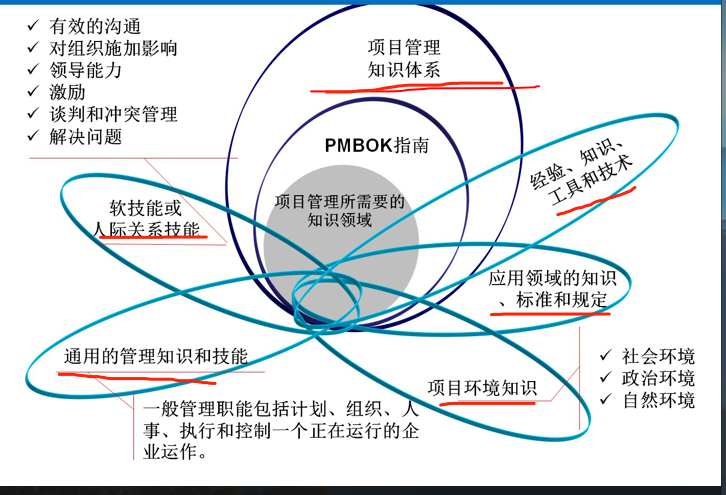

### 1.1.1 项目的基本概念

项目是为提供一项独特产品、服务、或者成果所做的临时性努力(工作).

特点：

1. 临时性(一次性)
2. 独特性(独特的产品、服务、或成果)
3. 渐进明细 （逐步完善）
4. 资源约束
5. 目的性

项目目标是指 所达到的期望结果。

项目的特征：

- 优先级(多目标)
- 层次性 --- (比如：可分解为wbs)

### 1.1.2 项目目标

成果性目标  ，简称项目目标。 通过项目 开发出客户要求的产品、服务、成果、

约束性目标，后称为管理性目标。 是指完成成果性目标所需要的时间、成本，及要求满足的质量。

项目目标要遵循SMART原则：

- s  具体的
- m  可测量的
- a  可达到的
- r  有相关性的 --和公司战略的相关性
- t  有时限的。

### 1.1.3

### 1.1.4 项目管理

项目管理的定义：  是在项目活动中 综合运用  **知识、 技能、 工具与技术**  在 一定的**时间，成本 质量**的要求下实现项目的成果性目标的一系列行为。

正确认识项目管理：

- 一种 **公认的管理模式**，  不是任意的一次管理过程
- 项目管理的 **对象是项目**。  是一系列临时任务。
- **对组织的资源** 进行 计划 组织 协调 控制
- 运用系统理论与思想， **把任务和人 看成一个整体**，实现整体目标
- 项目管理职能  只要 **由项目经理执行**。

### 1.1.5 项目管理需要的知识领域

- 项目管理指示体系

- 经验、知识 工具与技术。

- 应用领域的知识 标准  和规定

- 项目环境指示

- 通用的管理知识和技能

- 软技能或人际关系技能

  

  

### 1.2.1 项目与战略规划

