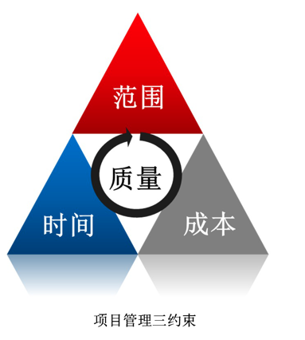

### 1.1.1 项目的基本概念

项目是为提供一项独特产品、服务、或者成果所做的临时性努力(工作).

特点：

1. 临时性(一次性)
2. 独特性(独特的产品、服务、或成果)
3. 渐进明细 （逐步完善）
4. 资源约束
5. 目的性

项目目标是指 所达到的期望结果。

项目的特征：

- 优先级(多目标)
- 层次性 --- (比如：可分解为wbs)

### 1.1.2 项目目标

成果性目标  ，简称项目目标。 通过项目 开发出客户要求的产品、服务、成果、

约束性目标，后称为管理性目标。 是指完成成果性目标所需要的时间、成本，及要求满足的质量。

项目目标要遵循SMART原则：

- s  具体的
- m  可测量的
- a  可达到的
- r  有相关性的 --和公司战略的相关性
- t  有时限的。

### 1.1.3

### 1.1.4 项目管理

项目管理的定义：  是在项目活动中 综合运用  **知识、 技能、 工具与技术**  在 一定的**时间，成本 质量**的要求下实现项目的成果性目标的一系列行为。

正确认识项目管理：

- 一种 **公认的管理模式**，  不是任意的一次管理过程
- 项目管理的 **对象是项目**。  是一系列临时任务。
- **对组织的资源** 进行 计划 组织 协调 控制
- 运用系统理论与思想， **把任务和人 看成一个整体**，实现整体目标
- 项目管理职能  只要 **由项目经理执行**。

### 1.1.5 项目管理需要的知识领域

- **项目管理知识体系**  -- PM必须具备

- **经验、知识 工具与技术。**

- **应用领域的知识 标准  和规定**

- **项目环境知识**

- **通用的管理知识和技能**

- **软技能或人际关系技能又叫  一般管理技能。例如： 沟通 领导 磋商。 ** -PM必须具备

  

  

### 1.2.1 项目与战略规划

**项目经常被当做实现组织战略计划的一种手段使用。**

以下一个或多个战略考虑因素  是项目批准的典型依据。

- 市场需求， 汽油短缺，   制造低油耗汽车。
- 运营需要， 某培训公司批准新设课程项目 增加收入。
- 客户要求。   电信局批准开发电话信息管理系统。
- 技术进步。  内存改进后， 批准研制新视频游戏机。
- 法律要求      有毒材料 使用须知。 

### 1.2.3 战略实施过程分解  

自上而下动态管理过程，  分析 -- 决策 --执行 --反馈 --再分析 --再决策 --再执行。的循环。包括四个阶段：

- 战略启动阶段     - 培训宣传
- 战略计划实施阶段   - 分阶段 分目标  量化
- 组织战略运作阶段   - 全面落实
- 组织战略的控制与评估  - 评估，控制， 纠正。

组织战略目标分解 和 组织战略管理的典型应用： 平衡记分卡。

### 1.2.4 组织战略的类型

组织战略的类型， 基于对组织事业解决这一核心问题。 可以分为四种战略类型：

防御者战略     - 成熟的组织， 保持稳定 或扩大市场份额。

探索者战略  -    华为， 用新技术 创新。 

分析者战略 -    结余二者之间。

反应者战略     -- 不打不动，  打一打 动一动。

### 1.2.5 战略组织的类型

指挥型     -- 一把手说了算

变革型   -- 空降兵比较多， 组织结构变化较大。高层变动较大。

合作型   --  最高层和管理层一起决策，民主。   战略的经济合理性有所降低。

文化型  ---  运用组织文化，传播思想， 动员全体成员。通常耗费人力 事件， 流于形式。

增长型  --- 调动积极性， 鼓励一般管理人员提方案。

### 1.2.6 战略管理的三个层次

目标层战略：明确使命 及战略目标。

方针层战略：选定特定的方式和路径。对战略行动做知道。
行为层战略： 执行。  是关系整个组织战略实现的关键要素。

### 1.3.1 项目组织结构类型

到了平衡矩阵 ，才出现了全职的项目经理。

### 1.3.2 PMO

PMP 是在所管辖范围内集中管理项目的组织内机构。  称为 项目办公室。 大型项目办公室 等。

可以为一个项目、 一个部门、 一个企业 成立PMO， 且三级PMO可以在一个组织内同时存在。

PMP有支持性(顾问)、控制型(提供支持+ 要求项目服从PMO的管理策略)、指令型(直接管理和控制项目) 三种。  指令型对项目的控制程度最高。 

**项目经理 和 PMO 追求不同的目标，   受不同需求所驱使**。

### 1.3.3 项目经理

项目经理的一般要求：

- 足够的知识
- 丰富的项目管理经验
- 良好的协调和沟通能力(80%的时间)
- 良好的职业道德
- 一定的领导力和管理能力-项目经理必须承担管理者和领导者的双重角色。
- **项目经理是整合者。**

优秀的项目经理：

- 真正理解项目经理的角色
- 领导并管理项目团队
- 惩罚分明
- 计划、计划、再计划。
- 真正理解 一把手工程
- 注重客户与用户参与。

### 1.3.4 项目干系人 (利益相关方)

### 1.3.5 发起人

发起人  为项目提供资金或实物等财力资源的个人和组织。    是项目成功的一个关键因素。

- 发起人一直在推动项目的进展， 包括 游说更高层的管理人员， 以获得组织的支持  并宣传项目给组织带来的利益。
- 从提出概念 到项目收尾， 处理超出项目经理控制范围的事项。

### 1.4.1 项目生命周期

